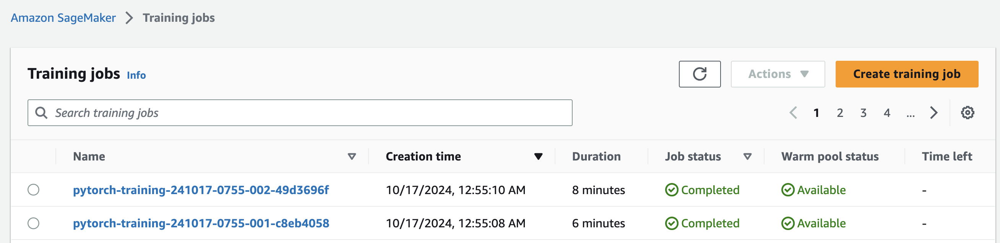
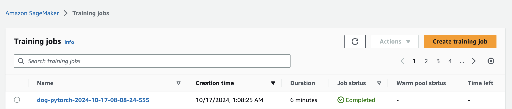
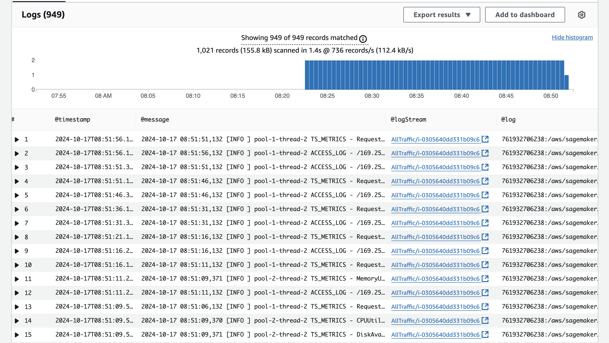

# Image Classification using AWS SageMaker

Use AWS Sagemaker to train a pretrained model that can perform image classification by using the Sagemaker profiling, debugger, hyperparameter tuning and other good ML engineering practices. This can be done on either the provided dog breed classication data set or one of your choice.
For this project, I used the provided dog breed classification data set.

## Project Set Up and Installation
Enter AWS through the gateway in the course and open SageMaker Studio. 
Download the starter files.
Download/Make the dataset available. 

## Dataset
The provided dataset is the dogbreed classification dataset which can be found in the classroom.
The project is designed to be dataset independent so if there is a dataset that is more interesting or relevant to your work, you are welcome to use it to complete the project.
For this project, I used the provided dog breed classification data set.

### Access
Upload the data to an S3 bucket through the AWS Gateway so that SageMaker has access to the data. 

## Explanation of the files
* `train_and_deploy.ipynb` - The main driver/entry point. The Jupyter notebook that is used to run the program. It trains a pretrained model to perform image classification using the Sagemaker profiling, debugger, hyperparameer tuning and other things.
* `hpo.py` - The python file that performs hyperparameter training/tuning
* `train_model.py` - script to perform model profiling and debugging.
* `img_reference.py` - script used to assist in deploying the model.


## Hyperparameter Tuning
What kind of model did you choose for this experiment and why? Give an overview of the types of parameters and their ranges used for the hyperparameter search

I used the Model RESNET50 because it is a highly popular convolutional neural network (CNN) architecture, primarily used in computer vision tasks such as image classification, object detection, and feature extraction. It is based on residual learning, widely available as a pre-trained model on large datasets, maintains a manageable size in terms of computational complexity and can be easily adapted for other tasks by adding or modifying layers for use in segmentation, object detection, image generation, and other vision-related tasks.

1. **Hyperparameter Definitions**:
   * `Learning Rate (learning_rate)`:
   * Type: ContinuousParameter
   * Range: 0.001 to 0.1
   * Description:
       The learning rate controls the step size in the gradient descent optimization process.
       A smaller learning rate (closer to 0.001) allows the model to make fine-grained updates but can increase
       training time, while a larger learning rate (closer to 0.1) allows for faster convergence but can cause the
       model to overshoot the optimal solution and destabilize training.
       ContinuousParameter allows the optimizer to sample any value between 0.001 and 0.1 during the hyperparameter
       search.
   * `Batch Size (batch_size)`:
   * Type: CategoricalParameter
   * Range: [32, 64, 128, 256, 512]
   * Description:
      The batch size is the number of training samples used in one forward and backward pass of the neural network.
      Smaller batch sizes (e.g., 32) may result in noisier updates but allow the model to generalize better. Larger
      batch sizes (e.g., 512) can stabilize updates and make training faster, but may require more memory.
      CategoricalParameter restricts the batch size to one of the given values, allowing the optimizer to select  
      from discrete choices.
2. **Metric Definitions**:
   * Metric to Track:
   * Name: "Test Loss"
   * Regex: "Testing Loss: ([0-9\\.]+)"
   * Description:
        The metric definition specifies which metric(s) to track during the tuning process and how to extract the metric
        from log outputs.
        The regular expression (Regex) provided is used to parse the logs for the Test Loss value, which should be a
        floating-point number (represented by [0-9\\.]+).
3. **Objective Metric**:
   * Objective Metric Name:
   * Name: "Test Loss"
   * Description:
        The Test Loss is the main metric the hyperparameter tuning process aims to optimize. It measures how well the
        model performs on unseen data (i.e., the test set).
        Typically, a lower test loss indicates better generalization of the model.
    * Objective Type:
    * Type: "Minimize"
    * Description:
        The tuning process is designed to minimize the test loss, which means the hyperparameter search will focus on
        finding parameter combinations that reduce the error on the test data.
        This is standard for most optimization problems related to loss functions, where the goal is to reduce errors and
        improve model accuracy.

This setup allows an automated search for the optimal learning rate and batch size combination that results in the lowest test loss.

Remember that your README should:
- Include a screenshot of completed training jobs
  * hyper-parameter training
  
  
  * Debugging_Profiling training
  

- Logs metrics during the training process
  
  
- Tune at least two hyperparameters:

    ```
    hyperparameter_ranges = {
        "learning_rate": ContinuousParameter(0.001, 0.1),
        "batch_size": CategoricalParameter([32, 64, 128, 256, 512]),
    }
    ```

- Retrieve the best best hyperparameters from all your training jobs

    ```
    best_estimator=tuner.best_estimator()
    best_estimator.hyperparameters()
    ```

## Debugging and Profiling
**TODO**: Give an overview of how you performed model debugging and profiling in Sagemaker

Model debugging and profiling enables me to monitor, detect, and diagnose common issues during training. Here's an overview of how I performed model debugging and profiling:

1. **Setting Hyperparameters**:
Hyperparameters like `batch_size` and `learning_rate` are extracted from the best-performing model (best_estimator) from my previous experiment. This ensures that I am using optimal hyperparameters for the next training job.

2. **Setting Debugging Rules**:
SageMaker provides built-in debugging rules that help monitor specific training conditions and flag common issues like vanishing gradients, overfitting, overtraining, and poor weight initialization. These rules automatically analyze training metrics and other relevant data.
The following rules have been added to monitor the training job:
* `Vanishing Gradient`: Detects if gradients are getting smaller as backpropagation proceeds through the network, leading to poor learning.
* `Overfitting`: Monitors if the model performs well on training data but poorly on validation data.
* `Overtraining`: Detects if the model is being trained for too many epochs, which can result in diminishing returns or performance degradation.
* `Poor Weight Initialization`: Checks if the initial weights of the model are poorly set, which could hinder effective training.
* `Profiler Report`: A profiling rule to generate detailed performance reports about system resource utilization and model performance.

3. **Configuring Debugging Hooks**:
Debugger Hook Configuration (`hook_config`) is set up to monitor the model's training and evaluation steps by saving the necessary tensors. The save interval for both training and evaluation steps is set to 1, meaning every step will be captured and analyzed. This frequent capture helps identify any irregularities early in the training process.

4. **Configuring the Profiler**:
The Profiler is configured to monitor system metrics like `CPU`, `GPU`, `memory usage`, and `disk I/O` every 500 milliseconds (system_monitor_interval_millis=500). This fine-grained system monitoring helps you understand how your training job interacts with the underlying infrastructure.
Additionally, the `framework profiling parameters` are set up to capture framework-level information (e.g., GPU utilization, kernel launches, etc.) every single step (num_steps=1), providing deeper insights into the performance of your training code.

5. **SageMaker PyTorch Estimator**:
The PyTorch estimator is instantiated with the following properties:
* `entry_point`: Specifies the Python script (train_model.py) used to train the model.
* `base_job_name`: Sets a base name for the SageMaker training job (dog-pytorch).
* `instance_count and instance_type`: Specifies the compute instance type (ml.m5.xlarge) and number of instances (1) used for training.
* `framework_version and py_version`: Specifies the version of PyTorch (1.8.0) and Python (3.6) used for the training job.
* `Debugger and Profiler Parameters`: The rules, hooks, and profiler configuration are integrated into the estimator.

6. **Training Job Execution**:
Finally, the training job is launched by calling the `.fit()` method on the estimator, with the path to the training data (`database_path`) provided as input.

### Results
**TODO**: What are the results/insights did you get by profiling/debugging your model?

The results from the profiling and debugging process provide several insights:

#### Debugging Rules
`Vanishing Gradient`: The rule remained "InProgress," meaning it did not detect severe issues related to vanishing gradients, though no specific insights were flagged in this initial run.

`Overfitting`: Still "InProgress," meaning no severe overfitting was flagged at this stage of the model’s short training process.

`Overtraining`: Also "InProgress," so no critical signs of overtraining were flagged.

`Poor Weight Initialization`: IssuesFound indicates that weight initialization may have been problematic, which could be affecting model convergence, explaining the poor performance and low accuracy.
#### Training Performance Insights
`Training Loss`: The initial training loss starts quite high (84.195), and accuracy is extremely low (0.0142 or 1.42%) after processing 10% of the training data. This suggests a challenging optimization process.

`Validation Loss`: The validation phase shows a similarly high loss (4.9319) and zero accuracy across the validation data, which indicates that the model struggles to generalize or is underfitting.

`Testing Loss and Accuracy`: After completing the testing phase, the model reports a testing loss of 4.909 and testing accuracy of 0.0095, suggesting almost no ability to predict on unseen data.
#### Profiling Insights
`Resource Utilization`: Since the instance type (ml.m5.xlarge) does not have GPUs, the profiler reported no GPUs detected. Profiling suggests the CPU resources (4 cores) were sufficient for this small-scale model training.

`System Performance`: The profiler captured Python cProfile stats for the execution of model steps, indicating that training processes were monitored closely. However, the low training performance suggests that system performance optimizations might not solve the root issue of the model's poor accuracy.
#### Potential Issues and Next Steps
`Poor Weight Initialization`: The flag here suggests re-evaluating how weights are initialized, possibly adopting better initialization techniques (e.g., He initialization for deep networks).

`Hyperparameters`: The learning rate might be too high (0.0877), causing unstable training dynamics. Consider reducing the learning rate to stabilize training.

`Training Duration`: The training was limited to only 1 epoch, which isn't enough to properly assess overfitting or overtraining. Extending the training time will provide better insights into model convergence.

`Profiler`: The Profiler detected bottlenecks during the forward pass. If extended training continues to show poor results, analyze the Python profiling results for optimization opportunities.

In conclusion, the primary concern is poor weight initialization combined with high learning rates, which hinder the model’s ability to learn effectively. Reducing the learning rate and revisiting the weight initialization strategy could yield better results.

**TODO** Remember to provide the profiler html/pdf file in your submission.

[debugging_profiling.pdf](debugging_profiling_model.pdf)


## Model Deployment
**TODO**: Give an overview of the deployed model and instructions on how to query the endpoint with a sample input.
### Deployed Model Overview

1. **Model Location**: The trained model is stored in an Amazon S3 bucket. Once the SageMaker training job finishes successfully, the model can be accessed via its S3 location

2. **Setting Up the SageMaker Environment**: To deploy the model, various SageMaker modules and configurations are imported, including: `PyTorch` for model hosting. `SageMaker Debugger` for profiling and monitoring during training. `Boto3` for interacting with AWS services. `Predictor and Model` classes to handle model deployment and inference.

3. **Image Prediction Setup**: An ImagePredictor class is created, inheriting from Predictor. It is customized for image prediction by setting the serializer to handle JPEG images and the deserializer to process JSON responses from the model

4. **Deploying the Model**: Using the trained model's data from the S3 bucket, a PyTorchModel object is created. The model is deployed to an endpoint 

5. **Making Predictions**: After the model is deployed, predictions can be made by sending image data to the endpoint. An image is downloaded using a URL, converted to bytes, and passed to the predictor for inference. The image bytes are passed as input. The ContentType is set to image/jpeg to handle the image format correctly.

### How to query the endpoint
```
predictor=pytorch_model.deploy(initial_instance_count=1, instance_type='ml.m5.large') # TODO: Add your deployment configuration like instance type and number of instances

import requests

#request_dict={ "url": "https://cdn1-www.cattime.com/assets/uploads/2011/12/file_2744_british-shorthair-460x290-460x290.jpg" }
request_dict={ "url": "https://s3.amazonaws.com/cdn-origin-etr.akc.org/wp-content/uploads/2017/11/20113314/Carolina-Dog-standing-outdoors.jpg" }

img_bytes = requests.get(request_dict['url']).content
type(img_bytes)

response=predictor.predict(img_bytes, initial_args={"ContentType": "image/jpeg"})
print(response)

import json
response2=predictor.predict(json.dumps(request_dict), initial_args={"ContentType": "application/json"})

response2[0]

```


